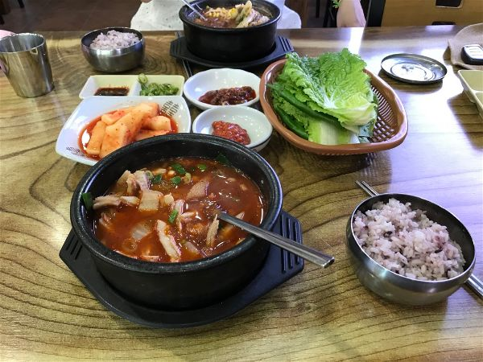
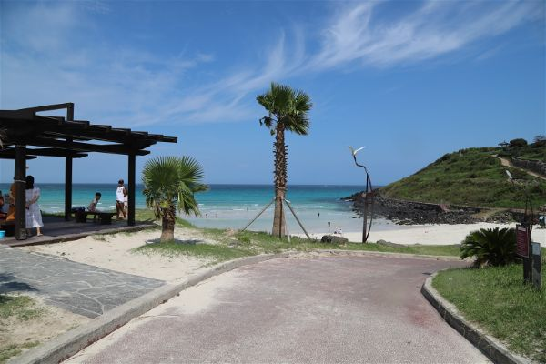
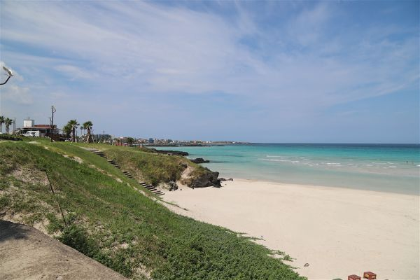
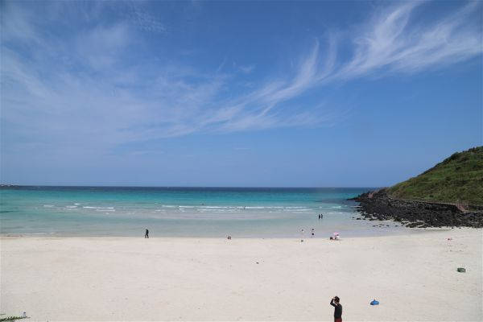
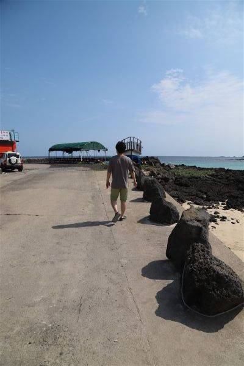
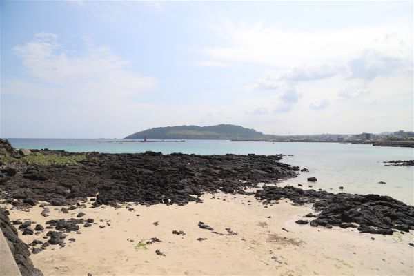
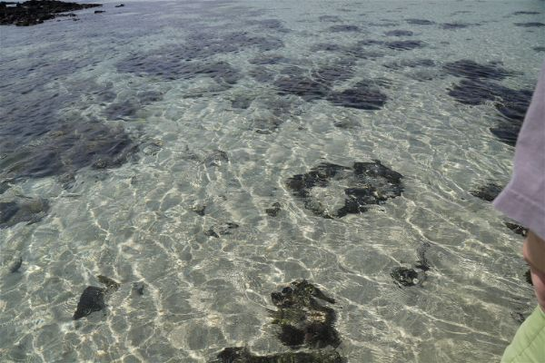
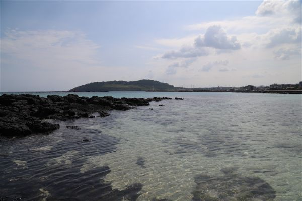
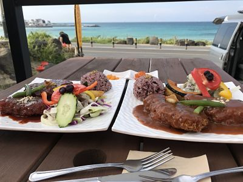

# 잃어버린 스마트폰

>두번째 날 우리는 오전 일찍 일어나 여친이 먹고 싶다던 골목해장국을 가기로 하였다.

오전에 일어나서 어제 제대로 구경하지 못했던 함덕 해수욕장을 보기로 하였다. 날씨도 좋고 바람도 시원하게 불어서 기분이 좋았다. 함덕에서 놀기 전에 식사부터 하기로 하고 어제 가려고 했지만 오후 3시까지만 영업해서 못 갔던 골목 해장국을 가기로 했다. 구석진 곳에 있어 음식점이 없을 것 같은 곳에 있었는데 어르신들이 세 테이블 정도 있었고, 먹고 있으니 관광객으로 보이는 아주머니, 아저씨들도 들어왔다. 우리가 제일 어렸다! ㅋㅋ

내장탕과 해장국, 개인적으로는 약간 비린내가 나는 듯 했지만 국물은 시원하였다.  
    비린걸 못먹는 사람에게는 비추천! 심하게 비리지는 않으나 나에게는 났다. 여자친구는 잘먹었음.
 

맛있게 먹고 우리는 해수욕장 끝 쪽으로 가서(이름이 기억이 안난다..) 튜브를 불고 들어가려고 했는데 해수욕장 폐장 기간이라 계속적으로 나오라고 방송이 나왔었다. 결국 들어가보지도 못하고 밖에서 사진만 찍고 장소를 이동하기로 하였다.

굉장히 푸르고 이뻤다. 사람도 그다지 많지 않아 해외 휴양지에 온 듯한 기분이 들어서 좋았다.
 

함덕해수욕장에서 그다지 멀지않은, 차로 약 10분정도의 거리를 서쪽으로 갔더니 스노클링하기 좋은 장소를 찾았다! 사실 우리가 제주도에서 있었던 곳 중에서 제일 좋았던 곳이다. 

> 다음날 부터는 서귀포에서 하려고 하였지만 날씨가 좋지 않아 스노클링을 즐기지 못하였다.

딱히 무언가가 있는 곳은 아니었지만 사람도 없었는데 우리가 거기서 하고 있으니까 다른 사람들도 와서 같이 하였다. 눈치 안봐도 되서 좋았다 ㅋㅋㅋ

당당하게 걷는 나의 모습. 시건방져 보이는군.
 

물이 굉장히 맑다. 굳이 안에 들어가지 않아도 밖에서 물고기들이 떼로 다니는 것을 볼 수 있었다. 소라게와 성게도 무진장 많았다.
 

처음에는 돌 밑에 모래색깔의 고기들과 니모같이 생긴 고기들만 보다가 갑자기 숭어떼가 나타나서 물 위를 날라다니길래 따라가서 물 속에서 보았다. 꽤 크더라.. 문어는 보고싶었지만 기회가 닿질 않았다.

여자친구는 바다 바닥까지 들어가서 소라도 줏어오고 했는데 나는 수영을 못해서 튜브위에 둥둥 떠있다가 발이 안닿아서 여자친구보고 구해달라고하였다……

> 나는 물이 무섭다....

3시 즈음까지 함덕쪽에서 스노클링을 하다가 다른 스노클링 포인트로 이동하자고 조르고 졸라서 김녕쪽을 지나 더 동쪽으로 갔는데 괜찮은 스노클링 포인트를 찾기가 힘들었다. (사람이 없고 무서운 곳은 내가 무서워서 안갔다..)

조금 더 찾다가 배가 고파서 식당을 먼저 찾았는데 옷이 다 젖어있어서 실내는 들어가기 힘들었는데 밖에서 먹을 수 있는 곳을 찾아서 들어갔는데 여자친구가 나보고 어떻게 알았냐면서 이 돈까스집이 자기 친구 아는 사람이 하는 곳이라고 하였다. 나는 그냥 배가 고팠을 뿐인데.. 준비를 안해놨었는지 음식이 나오기까지 시간이 걸렸지만 양도 많았고 경치가 좋아 맛있게 먹을 수 있었다.

해변이 보이는 곳에서 돈까스 !
 

이쪽에서는 스노클링 포인트를 찾지못해 여자친구에게 차라리 김녕에서 물놀이나 하자고 하고 김녕해수욕장으로 와서 놀다가 나중에 가는데 내가 스마트폰을 잃어버렸다. 1~2시간을 찾았는데 어디있는지 도통 찾을 수가 없어서 그냥 찝찝하고 슬픈 마음으로 숙소로 돌아왔다. 

저녁으로 제주 재래시장? 같은 곳에 가서 딱새우를 사먹기로 하고 다시 차를 타고 30분 정도 간 후에 시장에 갔는데 9시 쯤 인지라 가게가 대부분이 닫혀있어서 급한 마음에 입구에서 샀는데 정말 맛없었다. 더 들어가니 사람들이 많이 사는 곳은 아직도 열려있었는데 너무 아쉬웠다. 하지만 야시장에서 파는 먹거리들은 정말 맛있었다. 야시장에서 배를 채울 걸 하는 기분이 들었다. 숙소에 와서 회를 꺼내 먹었는데 너무 비리고 맛없어서 다 버렸다.. 아까운 돈 ㅠㅠ

맛없는걸 먹어 기분이 안좋았지만 여자친구가 맛있는 치즈를 들고와서 그걸 대신 술안주로 먹고 핸드폰 걱정에 잠 못 들다 잠이 들었다. (사실 피곤해서 금방 잤다.)

> 그런데.....???????????
>
> 나에게 행운이 찾아왔다.

다음 이야기로..