# 착한 제주도민, 맛있는 음식들

> 대명리조트 나오기전에 정리하고 사진을 한번 찍어보았다.  
>

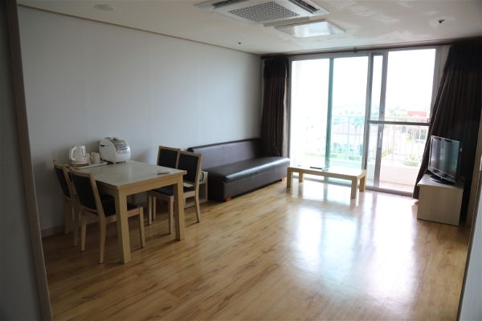

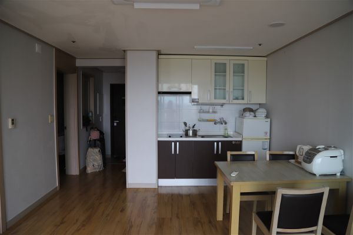

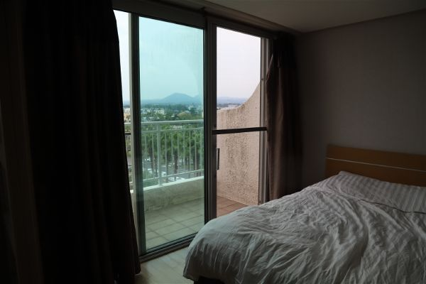

핸드폰을 잃어버려 하루동안 찜찜하게 있다가 저녁에 숙소에들어와서 하루종일 맥북으로 아이폰 찾기를 했으나 핸드폰이 꺼져있는지 위치추적이 안되고 심지어 화면이 꺼져있는 상태에서는 알림이 안울리도록 되어있었다. (나중에 알았지만...) 다행히 원격으로 폰 정지를 시키고 여친의 폰으로 전화할 수 있도록 전화번호를 띄워놓았다. 

다음날 퇴실도 해야하고 마지막으로 한번만 더 찾아보려고 김녕 해수욕장으로 다시 가려고 했는데 오전에 체크아웃하고 가는 도중에 내 핸드폰으로 전화가 되었다! 아주머니가 핸드폰을 발견하셨는데 핸드폰 배터리가 1프로라도 남아있어서 통화를 할 수 있었다.

마침 해수욕장에 막 들르신거라 바로 가서 받을 수 있었다. 사례로 일정 금액을 드리려고 했는데 괜찮다고 극구 거절하셔서 근처 마트에서 과일같은거라도 사드리려고 마트에 갔다가 차를 돌리는데 부주의로 렌트카 뒤가 돌에 살짝 콕하고 찍혔는데, 다행히 수퍼자차로 렌트해서 따로 추가비용은 들지 않았다… (빌리카)

> 핸드폰을 무사히 돌려받고 잘 되는지 확인하였는데 하루종일 비와 소금기 있는 모래에 쬐었더니 처음엔 소리가 잘안들리더니 일주일 지나니까 잘 되더라… 다행..

천천히 동쪽으로 향해 가다가 전복 맛집을 지나가면서 먹어보려고 했는데 1시간 넘게 기다려야해서 그냥 지나갔다. 행선지를 고민하다 섭지코지쪽으로 제주도 동쪽을 빙 돌아서 해변 드라이브를 하려 했으나 시간이 많이 늦을거 같아 섭지코지만 들리기로 했다.

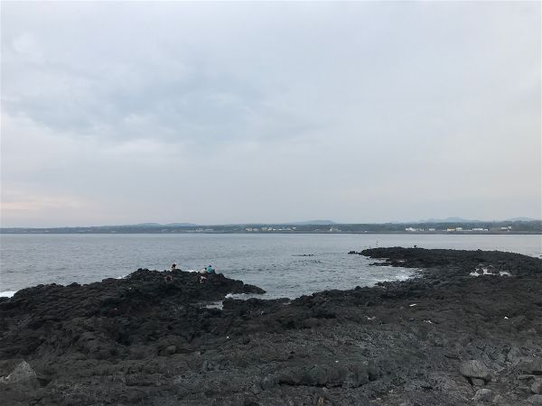

> 비가 왔지만 사람들이 암초에서 낚시도 하고 뭔가 줍기도 했다.

섭지코지 근처에 맛집이 있다고하여 여러군데를 찾고있는데 사람들도 많아서 한시간 이상 기다려야 하는 곳은 그냥 다음에 오기로 하고 내려오다보니 유명한 국수집에서 식사를 하였다. 

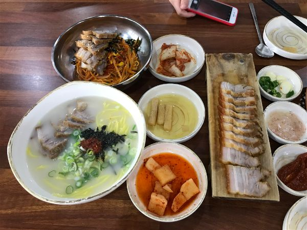

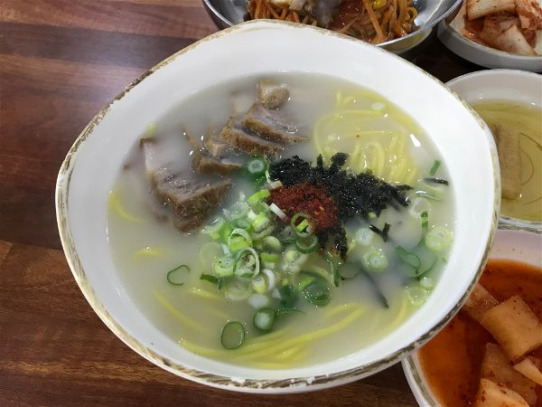

> 고기국수와 비빔국수 그리고 돔베고기. 호불호가 없을 정도로 보편적인 맛이다. 면과 고기를 싫어하는 사람이 있을까..?

맛있게 식사를 하고 여친이 숙소에 에어팟을 두고왔다는 사실을 깨닫고 호텔에 전화를 했는데 공식전화번호로는 몇일 걸린다고 해서 못찾을거 같다는 생각이 매우 들어서 체크인 하기전에 전화왔던 호텔전화로 다시 전화를 걸었는데 이미 다른 고객들이 체크인 하여서 찾기 힘들거 같다고 했는데 양해를 구하고 찾아본다고 했다. 확실히 어디에 두고 왔는지 알고 있었기 때문에 그쪽만 찾아봐달라고 하였는데 다행히 허락해주셔서 찾았다고 연락이 왔다. 다시 돌아오느라 3시간 정도를 허비하여 드라이브를 실컷하였다.

> 둘다 무언가 잃어버리고 정신이 없어서 여행이 어수선하고 동선도 좋지 않았지만 지금 생각해보면 그래도 다른 시간동안 즐거웠었다. 다음에 여행갈 때는 이런일이 없어야겠지만...

에어팟을 받고 한라산 국립공원쪽으로 가로질러 서귀포를 가는 길에 숲길에 들렀다. 사려니 숲길인지 붉은오름인지 명칭은 기억안나지만 전에도 한번 왔었던 곳인데 이번에는 안내소가 공사중이었다. 늦은시간에 도착하여 숲에서 잠깐 있었더니 금방 해가 지는데 무서웠다. 그래도 해가 있을때 사진은 많이 찍었다.

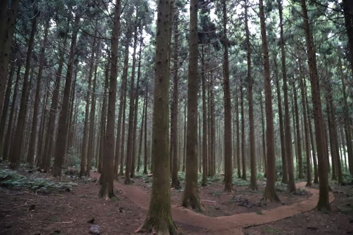

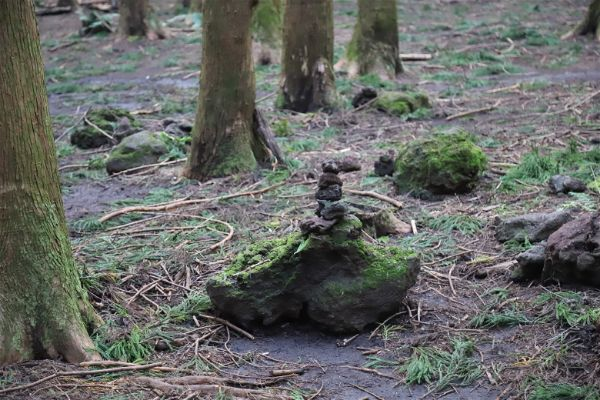

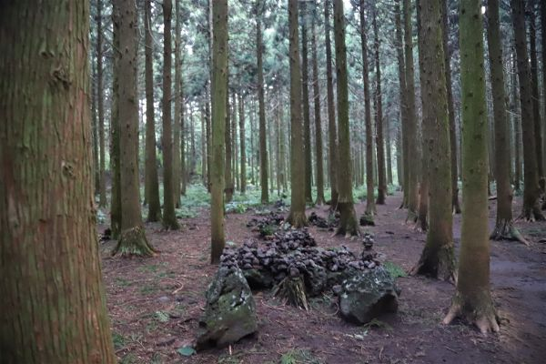

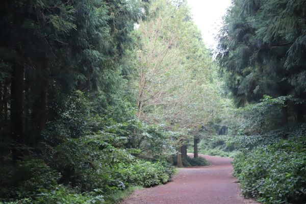

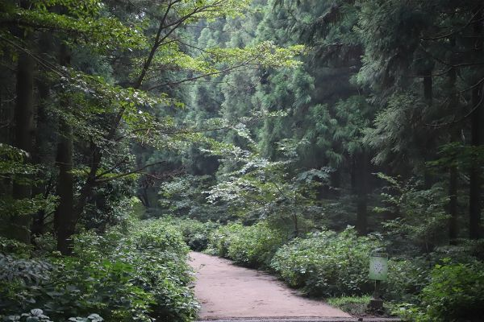

> 피톤치드 가득한 숲 공기를 마시며 정화를 하였다. 늦은시간이라 사람이 없었지만 사진찍는 여행객들은 간간히 볼 수 있었다.

우여곡절끝에 서귀포에 도착해서 체크인 하고 잠깐 있다가 올레시장에 들러서 치킨을 사려고 했는데 먹으려고 했던 치킨집은 이미 영업 끝이 나고 밥 먹을 곳도 못찾아서 귤이나 두봉지 사서 숙소에 돌아왔다.

서귀포에서 밤늦게 하는 음식점이 없을줄 알고 그냥 이마트에서 장을 보고 숙소에 오는길에 늦게까지 하는 식당들이 꽤 있었다. 괜히… 인터넷 검색만 하다가 못찾지 말고 직접 나가서 찾아보는게 좋았을 것 같았다… 아쉬웠지만 숙소에서 빵이랑 이것저것 먹었다.

서귀포에서는 예전에도 왔었던 섬오름 호텔에 왔는데 여전히 위치가 좋다. 그옆에 공사도 하던데 새로운 호텔이 들어설 예정인가 보다. 예전에 왔을땐 그래도 깨끗했는데 시간이 지나다보니 커튼에 먼지도 있고 예전같지 않았지만 제주도 풍경은 그대로 였다. 참 좋은 자리에 호텔이 있다.

> 많은 일이 있었던 하루였지만 맛있는 것도 먹고 숙소에 와서 푹 쉬고 다음날이 오기를 기다렸다.

제주도에서 살고싶다.